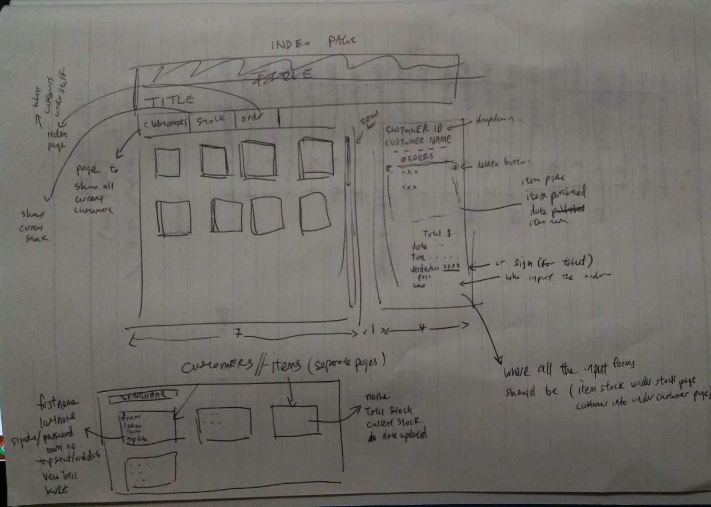
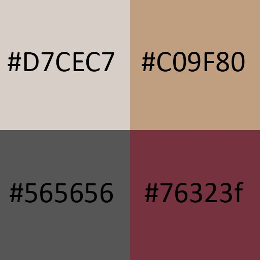

# POS System
[Click here for a link to the application](https://knownopear.github.io/UNDEPLOYED/)

### Overview

This application is built to be a tracking system for items, their sales and customers. It is built to allow its user to input what they are selling, the total stock that they have and how much the items cost. It also has a place for the user to input details about their customers.

---

### Ideation
This POS system came about from a need to have a system that did not require any transactions to be done within the app itself.

It was built from a business requirement of
* Item sales
* Total/current stock of items
* Customer details (Length of stay, items bought during their stay)
* Simplicity (The user may not speak english)

---

### Technologies Used
* **HTML5**
* **CSS3**
* **JQuery**
* **Express**
* **NodeJS**
* **blah blah**

---

### Development Approach
The client approached me with requirements for a point-of-sales system that did not require focus on the transactions part. It was more of stock-taking and tracking than transaction. As such, I built the app off the idea that no transactions would be taking place within the app itself.

What I set for myself to do is an app in which I could track the details such as total stock, current stock, price, name, and description of an item as well as the names, trip start/end dates, total items bought, total price of items bought by the customers. The user will input what the customers have bought/used and at the end of the customer's trip it would be easy to total everything up.

---

### Design

The wireframe design

The color scheme

---

### Important Functions
asdf

---

### Plans Ahead
asdf

---

### Things I have learnt
asdf

---
