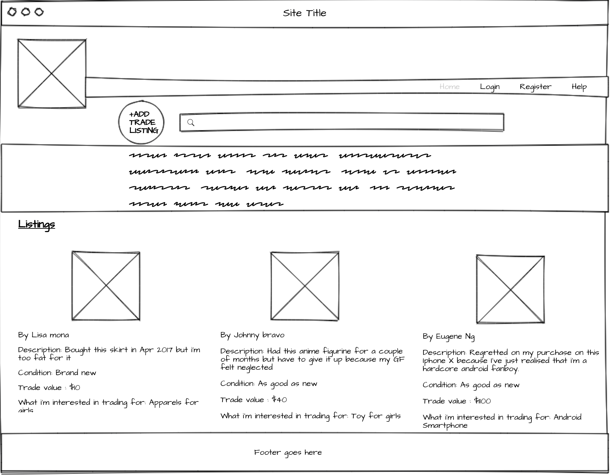
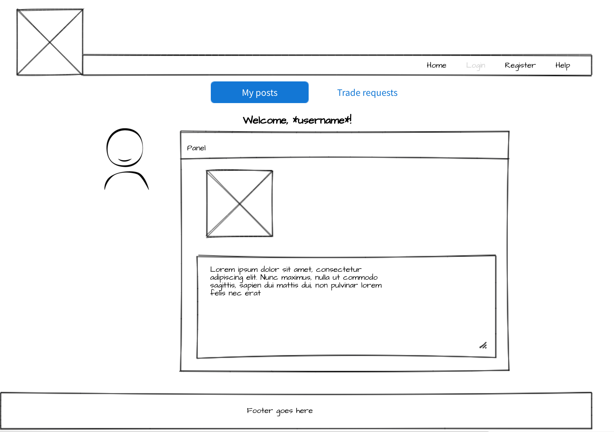

# Baaarter

Exchange (goods or services) for other goods or services without using money.


## Getting Started

Provide instructions here about how to get your project running on our local machine. Do we just need to clone and open a certain file or do we need to install anything first.

### Prerequisites

What is needed to install and run the project, how do we install them

```
//In the terminal of the project, type in://

yarn add nodemon
yarn add bcrypt
yarn add body-parser
yarn add connect-mongo
yarn add dotenv
yarn add express
yarn add express-handlebars
yarn add express-session
yarn add method-override
yarn add mongoose
yarn add passport
yarn add passport-local
yarn add path


```

## Live Version

https://baaarter.herokuapp.com/

## Built With

What did you use to build it, list the technologies, plugins, gems, packages etc.

* [Node.js](https://nodejs.org/en/)
* [mongoose](http://mongoosejs.com/)
* [express](https://expressjs.com/)

## Workflow

### User Story
As a user, I want to create a post with photos so that I can receive offers from others to trade my item with them.

### Wireframes





### ERD


### List of routes
listings_routes.js

login_routes.js

profile_routes.js

register_routes.js


## Acknowledgments

* foodiez [this was a useful starting point for creating the project](https://github.com/primaulia/foodiez).

* scrollreveal [have not fully incorporated it yet ](https://github.com/jlmakes/scrollreveal).
