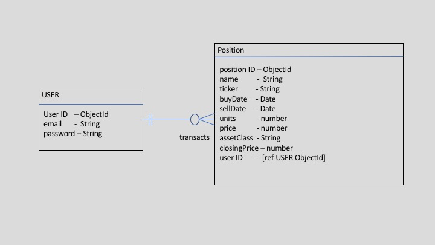

# My Portfolio Manager

This is the starter code for WDI projects. Please update this README file with information specific to your project. Replace this paragraph for instance, with a short description of your project. Then update the sections below. Refer to your project specificaion for instructions on how to submit your projects.

My Portfolio Manager is a simple investment tool to help an investor keep track of investments within a portfolio. It also provides an asset allocation view to help strategic allocation. It comprises the following features : user authentication, portfolio transactions, portfolio overview and basic charting.

## Live Version

Access the heroku deployment through this link : https://myportfoliomanager.herokuapp.com. Register to start tracking your portfolio.

## Built With

* [jQuery](http://jquery.com/)
* [Express](https://expressjs.com/)
* [Mongoose](http://mongoosejs.com/)
* [Passport](http://www.passportjs.org/)
* [CDNJS](https://cdnjs.com/libraries/Chart.js)

## Workflow
The user is required to register before gaining access to the transaction and portfolio pages. Individual holdings in any asset class (equities, bonds, alternatives and cash) can be recorded at the transaction date and price bought (other than cash). Updates to the price can be made to each holding and once a position is sold, it will be converted to cash at the date sold.

There are several limitations to this tool currently. Transaction entries and updates are manual.

Entity Relationship Diagram

## Acknowledgments

* my instructor (Prima) TAs (Shumin and Alex) for helping me understand where my codes have gone wrong and Ray Tham for teaching me what he knows about aggregation in Mongoose.
