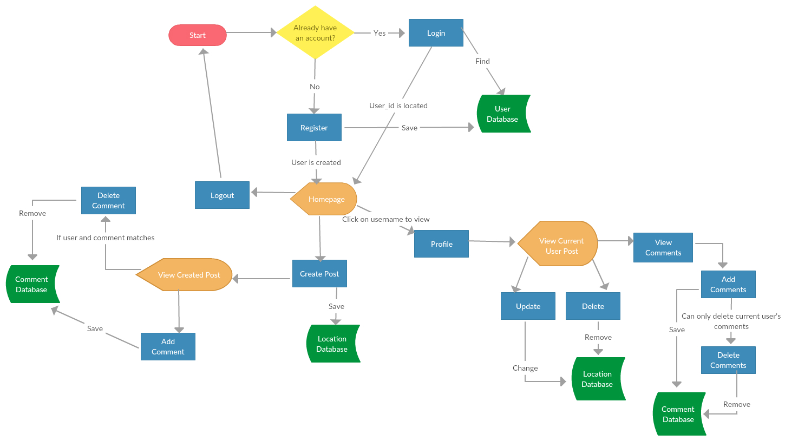
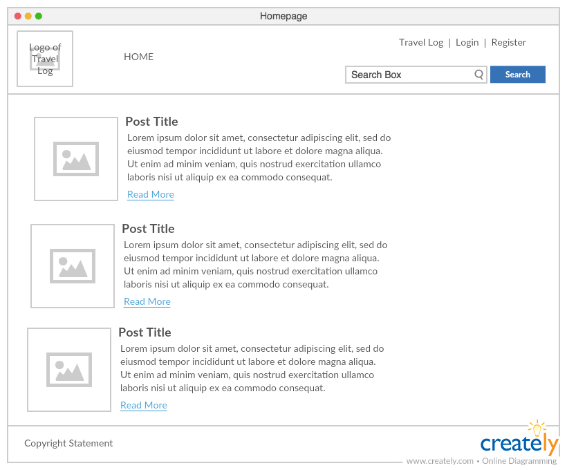
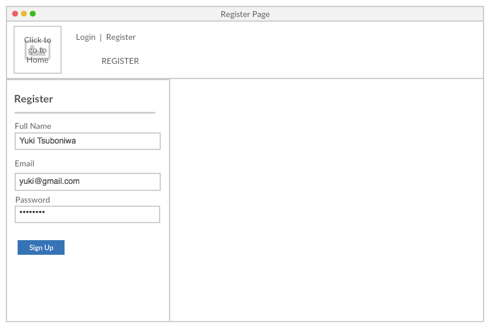
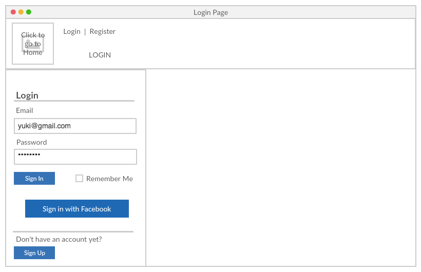
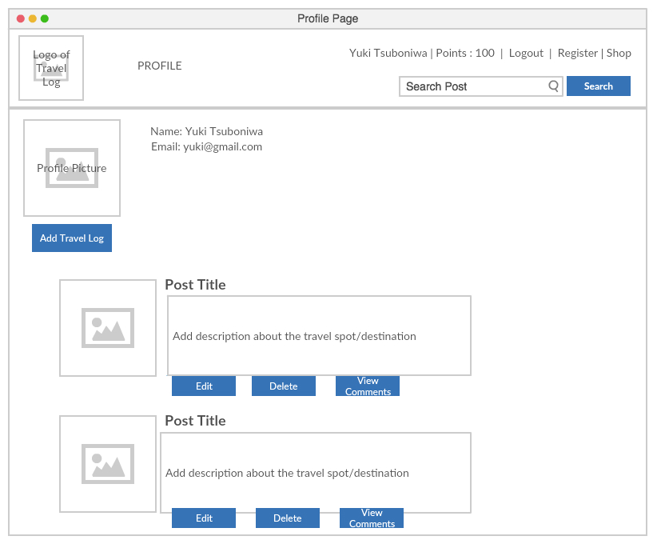
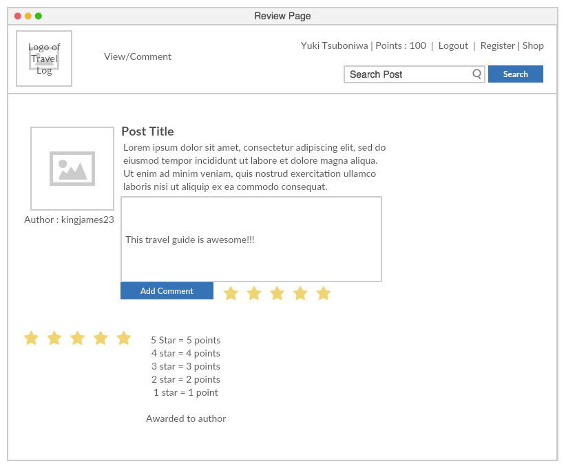

#  Yuki Tsuboniwa: "Project #2"

#  Project #2: Travel Log

https://travelog-yukitsuboniwa.herokuapp.com/

### Overview

  Travel Log is a web app built using Node, Express and MongoDb. It is designed for users to be able to create an account and login. The user are able to Create, Read, Update and Delete their posts. The idea is for them to share their travel experiences and be able to add comments and communicate with other user to share their opinions and experiences to one another.

### Entity Relationship Diagram

### Flowchart

### Wireframes

Homepage

Register

Login

Profile

Comment/Review

### Built With

1. Creately - creating ERD, Flowcharts and wireframes
2. Bootstrap and Bulma - CSS frameworks
3. Cloudinary - for uploading images
