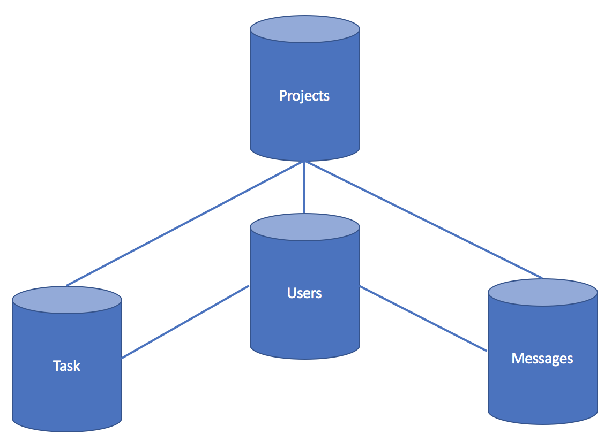
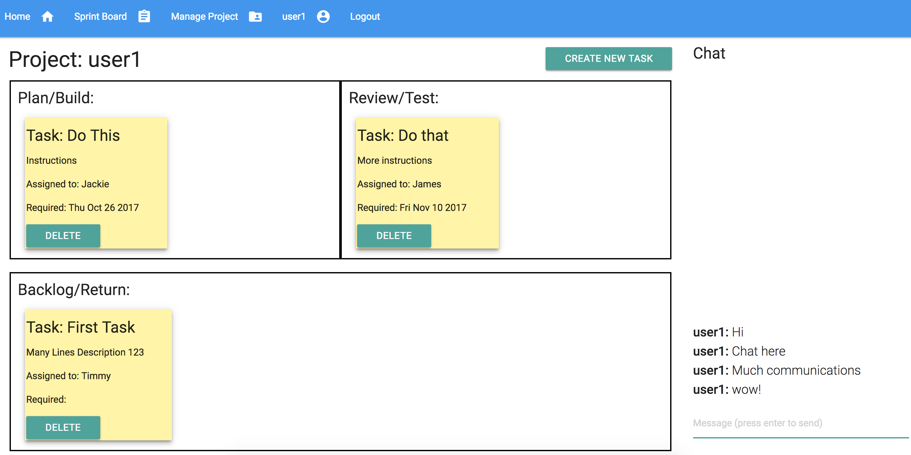

# Team Task Manager

Link to site:
http://159.89.194.112/

The Team Task Manager is to help teams be agile even when working offsite. The sprint board list all tasks for the project in real time and any edits are reflected onto all team members.

In addition, the Team Task Manager comes with inbuilt communication tools.

## Getting Started

1. Create .env file in main directory - add SESSION_SECRET
2. yarn install - to install dependencies
3. ensure mongodb is up and running on your local machine

## ERD

1. Projects
2. Tasks
3. Users
4. Messages

## Wireframes

The bulk of the website is on the Sprint board.

## List of Routes

- Login
- Register
- Index (shows list of users and projects)
- Profile (shows list of task)
- Manage Project (allows creating, joining, and leaving projects)
- Sprint Board (shows the task management board)
