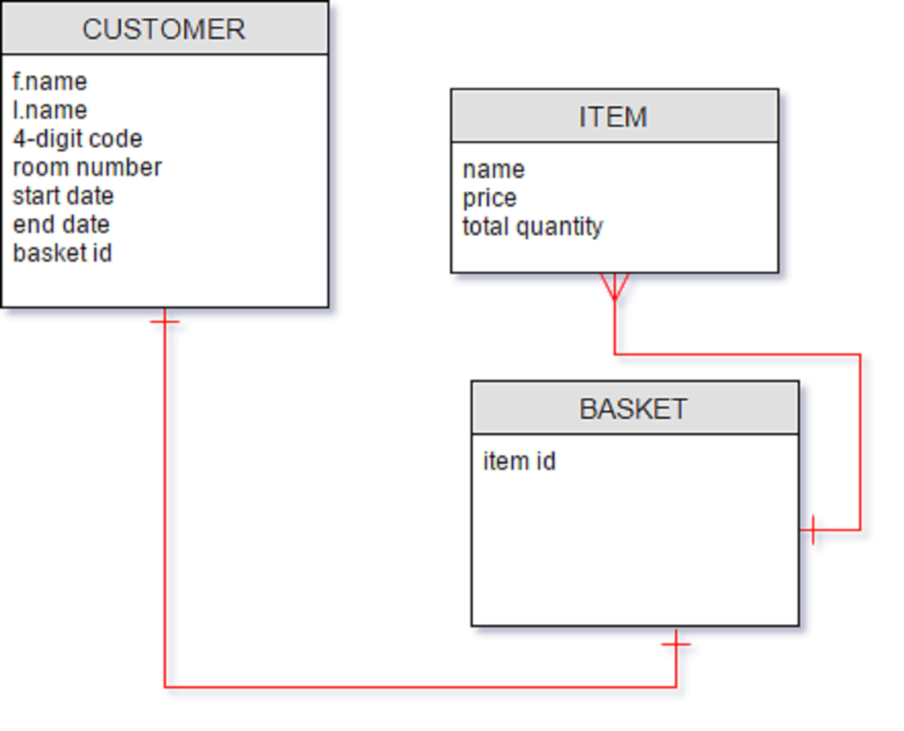

# POS Application

[CLICK HERE](https://guarded-thicket-64693.herokuapp.com/)

### Overview
This application was built to allow users to record and store information about what customers have bought and used while on a holiday trip. In this case, the customers will be on-board a ship where they may order items and equipment from the employees. The employees will use this application to input whichever customer and what they have bought/used. At the end of the trip, the employee is able to simply select the customer on the app and their information will be displayed together with their total bill.

Their bill will include the names of the items that they have bought/used, the date the order was placed, the quantity that was ordered, as well as the price of each individual item. The client's request was there to not be any transaction done within the app as cash payment was preferred.
---
### Ideation
It was built from a business requirement of
* Item sales
* Equipment rental
* Total/current stock of items
* Customer details (Length of stay, items bought during their stay)
* Simplicity (The employee may not speak English)
---
### Development Approach
The client approached me with requirements for a point-of-sales system that did not require focus on the transactions part. It was more of stock-taking and tracking than transaction. As such, I built the app off the idea that no transactions would be taking place within the app itself.

What I set for myself to do is an app in which I could track the details such as total stock, current stock, price, name, and description of an item as well as the names, trip start/end dates, total items bought, total price of items bought by the customers. The user will input what the customers have bought/used and at the end of the customer's trip it would be easy to total everything up.
---
### User Stories
* Guests
  - Can place order for items (food, drinks, equipment) with employees


* Employees
  - Can input guest order
    - order will only go through if there's stock
    - orders are saved under each customer

  - Can change guest order

  - Can add new customer details
    -Will contain their names, the start and end dates of their trip, room number

  - Can come up with a total for customer's order with list of ordered items
    - Quantity of items * price of items

  - Can add/delete new items to database
    - Includes their name, price/piece, total stock
---
### Workarounds
**Some code workaround**
```  
$( ".itemList" ).append( `<div class='singleItem' id=${id}>
  <span> ${name} </span> &nbsp; <button type='button' class='deleteCartItemBtn'>Delete</button>
  <p>SGD$: ${price} </p>
  <input class='addQuantity' type='number' value='1' min='0'>
  &nbsp;

  </div>`);
});

```
At this point, I was not very well versed with ES6, so I learnt from doing it this way.
If we just do an append with normal jQuery, it cannot be the target of class-specific functions. This ES6 workaround worked.
---
### Design
* Wireframe

The wireframe design
---
### ERD

---
### Plans Ahead
* Updating of customer details
* Updating of items
* Stock changes
* Logins for employees (Differentiating between who's assisting the customer in ordering)
---
### Acknowledgements
My classmates and instructors from WDI-13
:bow:
---
