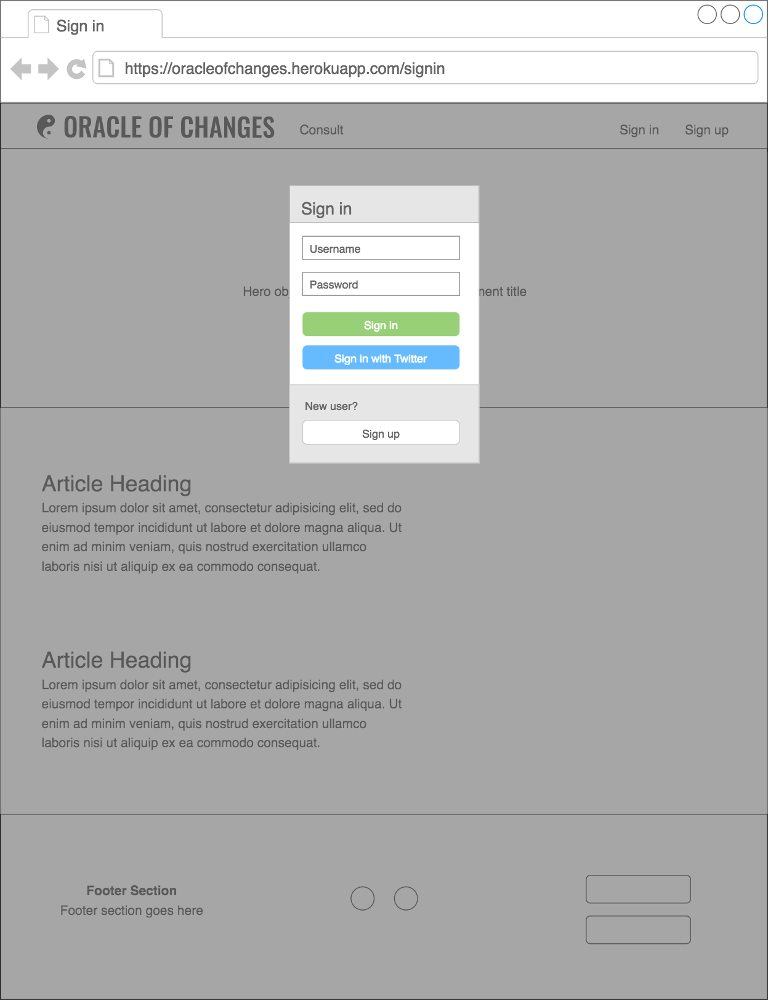
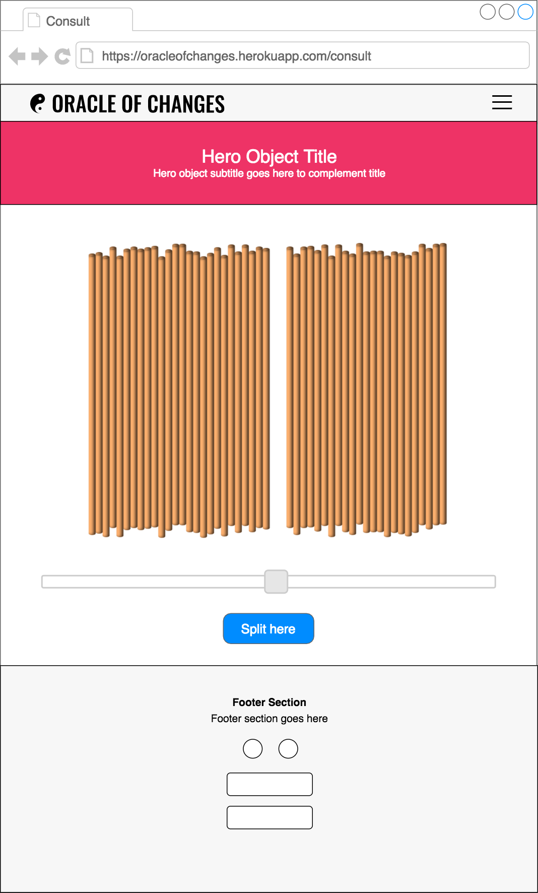
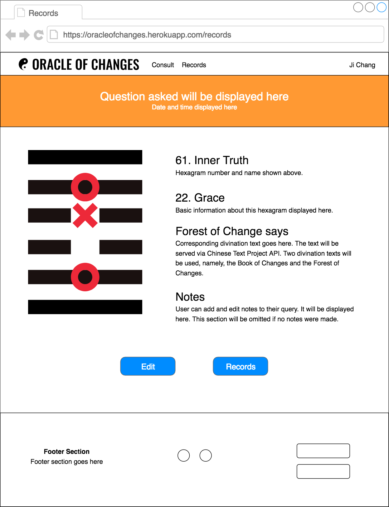

#  Project #2: Oracle of Changes

<!-- This is the starter code for WDI projects. Please update this README file with information specific to your project. Replace this paragraph for instance, with a short description of your project. Then update the sections below. Refer to your project specificaion for instructions on how to submit your projects. -->

## Getting Started

<!-- Provide instructions here about how to get your project running on our local machine. Do we just need to clone and open a certain file or do we need to install anything first. -->

### Prerequisites

<!-- What is needed to install and run the project, how do we install them -->

```
Code example
```

### How to Use

<!-- A step by step guide on how to install and use the project, for example if this is a game, how do we play it. -->

```
Code example
```

<!-- More steps... -->

```
until finished
```

## Live Version

<!-- Where is this deployed online (github pages, heroku etc), give us the link and any access details we need. -->

## Built With

<!-- What did you use to build it, list the technologies, plugins, gems, packages etc. -->

- [Bulma v0.6.1](https://bulma.io) 
- [jQuery UI v1.12.1](https://jqueryui.com)
- [jQuery](http://jquery.com/)

## Workflow

<!-- Did you write user stories, draw wireframes, use task tracking, produce ERDs? Did you use source control, with regular commits? Include links to them here. -->

### Wireframes

#### Landing page

The navigation bar slides up and hides itself when the page is scrolled up. It will slide down to reveal itself again when the page is scrolled down.


#### Sign in modal



#### Sign up modal


#### Consult Oracle page

Desktop and laptop users can hover their mouse cursors over the yarrow stalks and the gap will follow the cursor. The mouse cursor will change from the default arrow to a gloved hand pointer when it is over a gap. Upon reaching the desired spot, simply click on the gap to split the yarrow stalks. Clicking on the stalks will not trigger any split.


The slider bar below the yarrow stalks is primarily intended for smartphone and tablet users as they will not be able to hover over the stalk and precisely choose where the spilt the stalks. With the slider bar, smartphone and tablet users will be able to split the stalk with the same precision as desktop and laptop users. 

The yarrow stalks will resize to fit the width on smaller screens.



#### Navigation Bar Burger and Menu for Smaller Viewports


#### Display of divination result and individual past record




### User Stories

As a user of the Oracle of Changes

<!-- ## Authors -->

<!-- Did you collaborate with others on this project, list them here -->

<!-- - **John McClain** - *Responsible for keeping vests white* - [GithubUserName](https://github.com/GithubUserName) -->

## Acknowledgments

- [Chinese Text Project](http://ctext.org/)
  <!-- - Hat tip to anyone who's code was used, for example [this was a useful starting point for creating this template](https://gist.github.com/PurpleBooth/109311bb0361f32d87a2). -->

