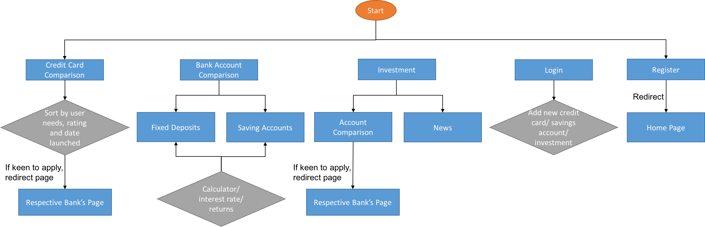
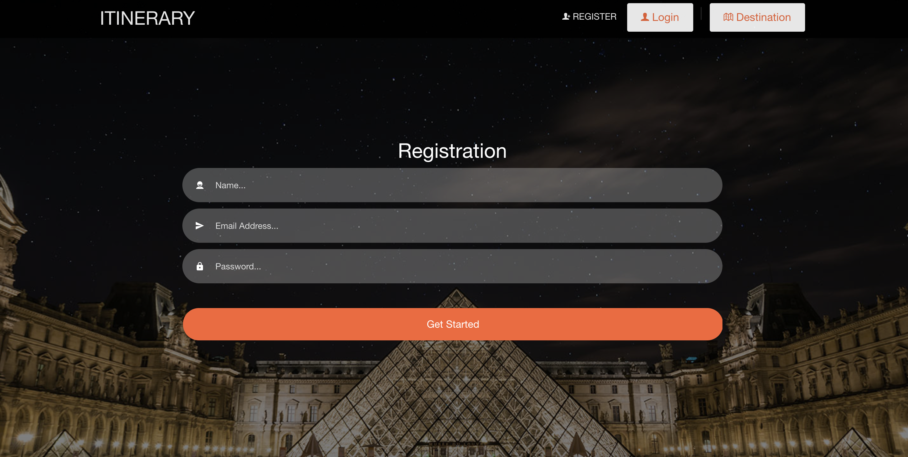
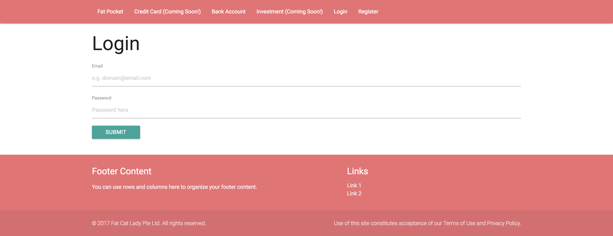
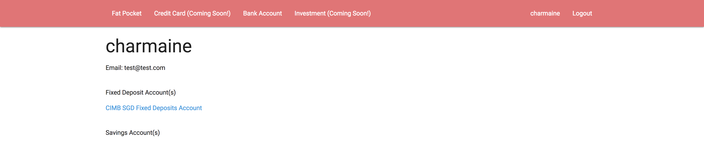
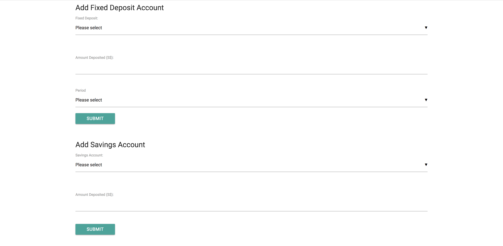
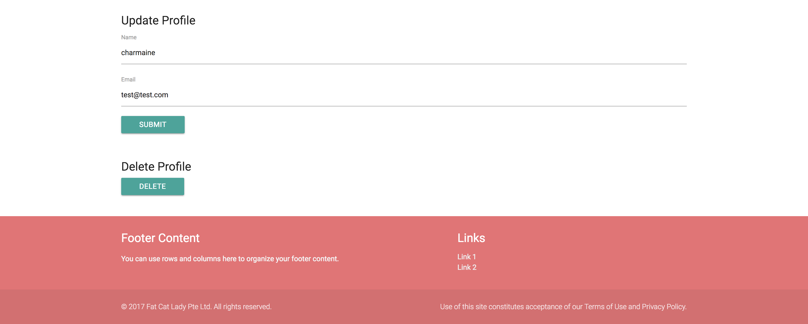
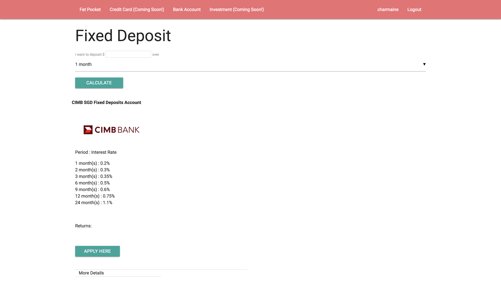
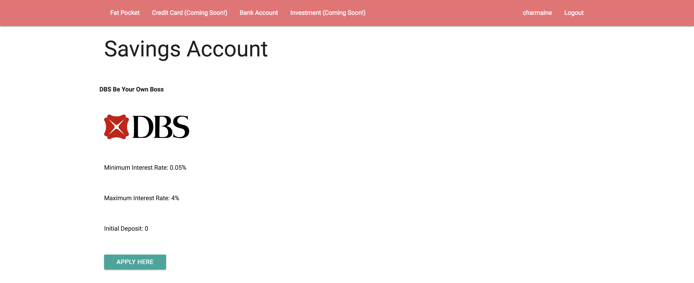

#   Fat Pocket

Founded in 2017, Fat Pocket aims to help Singaporeans maximize their money by empowering them to make smarter financial decisions by aggregating and consolidating product information to a single platform for comparison that's personalized to their unique consumer profile.

Apart from the other SG-based finance portals, Fat Pocket allows its users to sync all his/ her savings account(s), fixed deposit(s), credit card(s) and investment account(s) for an overview of his/her assets.

## Live Version
* https://fatpocket.herokuapp.com/

#### Objectives
Users to be able to
* Compare and get the best credit card(s)/ bank account(s)/ investment account(s)
* Sync all of his/ her credit card(s)/ bank account(s)/ investment account(s) to his/her Fat Pocket account for an overview of his/her assets

## ERD

## Wireframes

#### RegisterPage:

#### Login Page:

#### User Profile Page:

#### Eatery Page:

#### Rating/Review Page:

## To Be Added

* Sort Credit Cards/ Bank Accounts/ Investment Accounts according to keywords
* Credit Cards database and comparison
* Investment Accounts database and comparison
* Investment News
* Sync and display the user's Credit Cards/ Bank Accounts/ Investment Accounts on his/her profile page

## Built With

* HTML5
* CSS3
* Javascript
* Node
* Express
* Materialize - front end framework

## Acknowledgments

* Image Credits: Google Images
* Special thanks to Prima, Shumin, Alex, Ray and Persis
