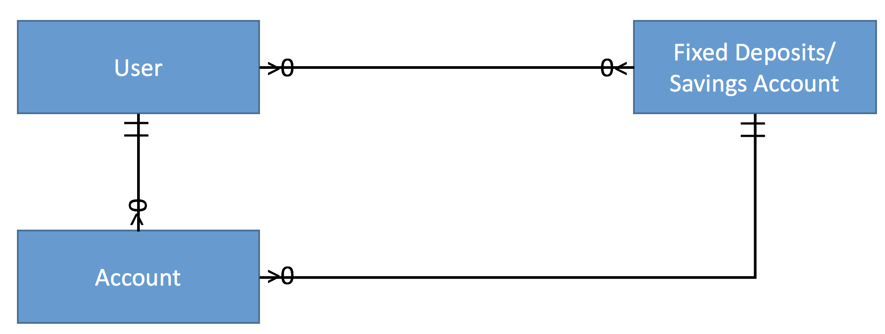

# Greenie GoGo!

# Project #1: Greenie GoGo!

https://greeniegogo.herokuapp.com/

## Problem :
- No idea where to get reasonable wholesale vegetables  
- Time consuming to look for suppliers
- Lost of name cards of supplier

## Target Audience :

- Restaurant
- Hawker
- Coffee Shop

## Objective :

Able to find wholesales suppliers within 2 clicks. Users can compare the prices and see their minimum order accepted by suppliers. Save up unnecessary effort to call supplier can straight look for another supplier instead.

## ERD Diagram :

## To Be Implemented :

- Able to edit vegetables details use by the admin
- A search functionally to filter suppliers by name, address
- Customer able to purchase directly without calling supplier
- Recommend customer, appropriate supplier according to their business type, as some supplier do not accept small orders

## Built With :

- HTML5
- CSS3
- Javascript
- Node
- Express
- Bootstrap 4

## Acknowledgments

- With the help of my senior (Alex)
