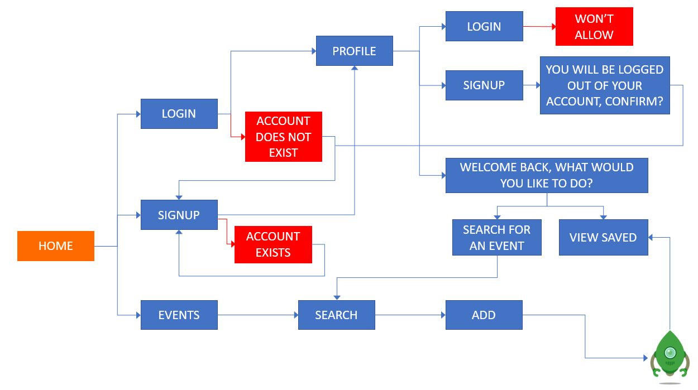
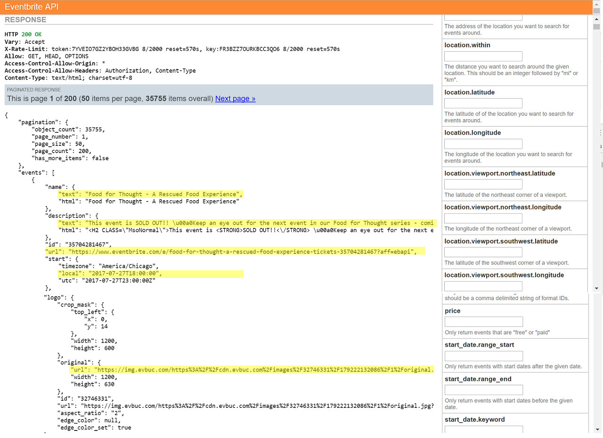

<!---
Read Me Contents
-->

#  Project #2:
# **Eventory**
#### Your Events Bookmarking Manager


**[View It Here](http://serene-badlands-64761.herokuapp.com/)**

---
### Overview

Eventory, a lifestyle platform that aids as a bookmarking tool, allows one to make a personal inventory of events hosted within Singapore.

Core idea stems from the desire to create a Google microsite. Due to limitation in resources and restritions, the model was scaled down to focus on rendering events-based search results.


---
Pre-Development Phase
---

* **Entity Relationship Diagram:**

  
  A user can peg many events.

<br>
* **Web Flow Diagram:**
  

  Schematic overview of website and functionalities.


---
Development Phase
---
* **Accessing Eventbrite API:**


  Highlighted are the core values to be targetted.


  * **Defining the Models:**

  ```Javascript
  const userSchema = new Schema({
    name: {
      type: String,
      required: [true, 'Please type your name']
    },
    email: {
      type: String,
      required: [true, 'Please type your email'],
      match: emailRegex
    },
    password: {
      type: String
    },
    events: [{
      type: Schema.Types.ObjectId,
      ref: 'Event'
    }]
  })
  ```
  ```Javascript
  var eventSchema = new Schema({
    name: {
      type: String,
      required: [true, 'Name is required']
    },
    dateTime: {
      type: String,
      required: [true, 'Date and Time required']
    },
    imgUrl: {
      type: String
    },
    eventUrl: {
      type: String,
      required: [true, 'Event link required']
    }
  })
  ```

* **Searching for Events and listing them:**

  ```Javascript
  $eventSearch.on('submit', function (e) {
    e.preventDefault()

    var keywordObj = $(this).serializeArray()
    var keyword = keywordObj[0].value
    var qString = `q=${keyword}`
    var sort = `&sort_by=date&location.address=singapore`

    var finalUrl = `${apiUrl}${qString}${sort}${apiKey}`
    ajaxTextSearch(finalUrl, keyword)
  })

  function ajaxTextSearch (finalUrl, keyword) {
    $spinner.fadeIn()

    $.get(finalUrl).done(function (data) {
      $spinner.fadeOut()

      var results = data.events

      $keywordSearch.text(`Results for keyword: ${keyword}`)

      if ($searchResults.find('li').length) $searchResults.html('')

      results.forEach(function (event) {
        var $newLi = $('<li>')
        var $newH2 = $('<h2>')
        var $newP = $('<p>')
        var $newP2 = $('<p>')
        var $newImg = $('')
        var $newBr = $('<br>')

        var year = event.start.local.slice(0, 4)
        var month = event.start.local.slice(5, 7)
        var day = event.start.local.slice(8, 10)
        var monthJS = month - 1

        var hour = event.start.local.slice(11, 13)
        var minutes = event.start.local.slice(14, 16)
        var seconds = event.start.local.slice(17, 19)

        var d = new Date(year, monthJS, day, hour, minutes, seconds)

        var $addBttn = $(`<button class="addBttn"
          data-name="${event.name.text}"
          data-dateTime="${d.toString()}"
          data-imgUrl="${event.logo.url}"
          data-eventUrl="${event.url}"
        >add</button>`)

        $newH2.text(event.name.text)
        $newImg.attr('src', event.logo.url)
        $newP.text(d.toString())
        $newP2.text(event.description.text)
        $newLi.append($newH2,$newP, $newImg, $newP2, $addBttn, $newBr)
        $searchResults.append($newLi)
      })
    })
  }
  })
  ```
<br>
* **Peg a returned Event:**

  ```Javascript
  $searchResults.on('click', '.addBttn', function (e) {
    e.preventDefault()

    const theBttn = $(this)

    var newEvent = {
      name: theBttn[0].dataset.name,
      dateTime: theBttn[0].dataset.datetime,
      imgUrl: theBttn[0].dataset.imgurl,
      eventUrl: theBttn[0].dataset.eventurl
    }

    $.post('/events', newEvent).done(function (data) {
      if (data.status === 'ok') {
        alert('Hurray! ' + data.message)
      }
    })
  })
  ```
<br>
* **Creating an Account:**

  ```Javascript
  $newUserForm.on('submit', function (e) {
    e.preventDefault()

    $formData = $(this).serializeArray()

    var newUser = {
      user: {
        name: $formData[0].value,
        email: $formData[1].value,
        password: $formData[2].value
      }
    }

    $.ajax({
      url: '/users',
      type: 'post',
      data: JSON.stringify(newUser),
      dataType: 'json',
      contentType: 'application/json',
      success: function (output) {
        console.log(output)
      }
    })
  })
  ```
<br>


* **Route for User**

  ```Javascript
    router.get('/profile', notLoggedIn, usersController.list)

    router.get('/new', function (req, res) {
      res.render('users/new', {
        user: req.user
      })
    })

    router.get('/login', LoggedIn, function (req, res) {
      res.render('users/login', {
        message: req.flash('error')
      })
    })

    router.post('/login', usersController.login)

    router.post('/new', usersController.create)
    ```
<br>
* **Checks if User is currently Logged In**

    ```Javascript
    module.exports = function(req, res, next) {
      if (req.user) {
        flash: req.flash('message', 'YOU ARE CURRENTLY LOGGED IN')
        res.redirect('/users/profile')
      } else {
        next()
      }
    }
    ```

    ```Javascript
    module.exports = function(req, res, next) {
      if (!req.user) {
        flash: req.flash('message', 'LOG IN REQUIRED')
        res.redirect('/users/login')
      } else {
        next()
      }
    }
    ```
<br>

* **Route for Event**

  ```Javascript
  router.get('/', function (req, res) {
    res.render('events/index', {
      user: req.user
    })
  })
  router.post('/', eventsController.create)
  ```

  <br>
* **Tagging Event to User**

    ```Javascript
    function create (req, res) {
      var newEvent = new Event({
        name: req.body.name,
        dateTime: req.body.dateTime,
        imgUrl: req.body.imgUrl,
        eventUrl: req.body.eventUrl
      })

      newEvent.save(function (err, newEvent) {
        if (err) return res.send(err)

        res.send(
          newEvent
        )
        User.findOne({_id: req.user.id}, function (err, foundUser) {
          if (err) res.send(err)
          foundUser.events.push(newEvent._id)
          foundUser.save()
        })
      })
    }
    ```

    <br>

* **Showing Eventory**

    ```Javascript
    function list (req, res) {
      User.findOne({_id: req.user.id}).populate('events').exec(function (err, user) {
        if (err) res.send(err)

        res.render('profile', {
          user: user,
          flash: req.flash('message')
        })
      })
    }
    ```

---
Future Implementations
---

* Succesfully show flash messages.

* Implement additional pages to render results.

* Ability to export eventory via email, or download.

* Ability to sync with calender.

---
Built With
---
* [Heroku](https://dashboard.heroku.com/) - Deployment
* [Eventbrite](https://www.eventbrite.com/developer/v3/) - API
* [Pure](https://purecss.io/) - CSS Module
* [Foxyform](http://www.foxyform.com/) - Contact Form
* [JqueryUI](https://jqueryui.com/autocomplete/) - Autocomplete
* [Node](https://jqueryui.com/autocomplete/) - Backend Setup
* [Passport](https://jqueryui.com/autocomplete/) - Authentication
* [Bcrypt](https://jqueryui.com/autocomplete/) - Password Hashing
* [Jquery](https://jqueryui.com/autocomplete/) - DOM manipulation
* [Mongodb](https://www.mongodb.com) - Database
* [Mongoose](mongoosejs.com) - Object Modelling
* [Handlebars](http://handlebarsjs.com/) - Templating Engine
* **CSS** - Style Sheets
* **HTML5** - Web Page Structure

---

### Acknowledgements

** Videos **

* Rea Burla
* Luke Shepard
* Saengthit Kamlangchai
* Dimid Vazhnik
* Yury Sirri Nakvas
* Daniel Smukalla
* Sebastian Eiseman
* Vadim Tereshchenko
* [Tink Labs Limited](https://www.handy.travel/en)
