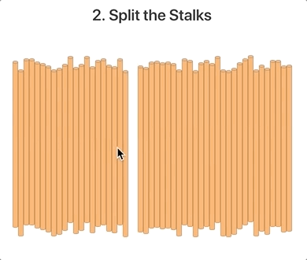
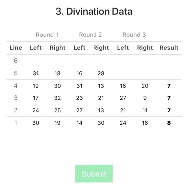
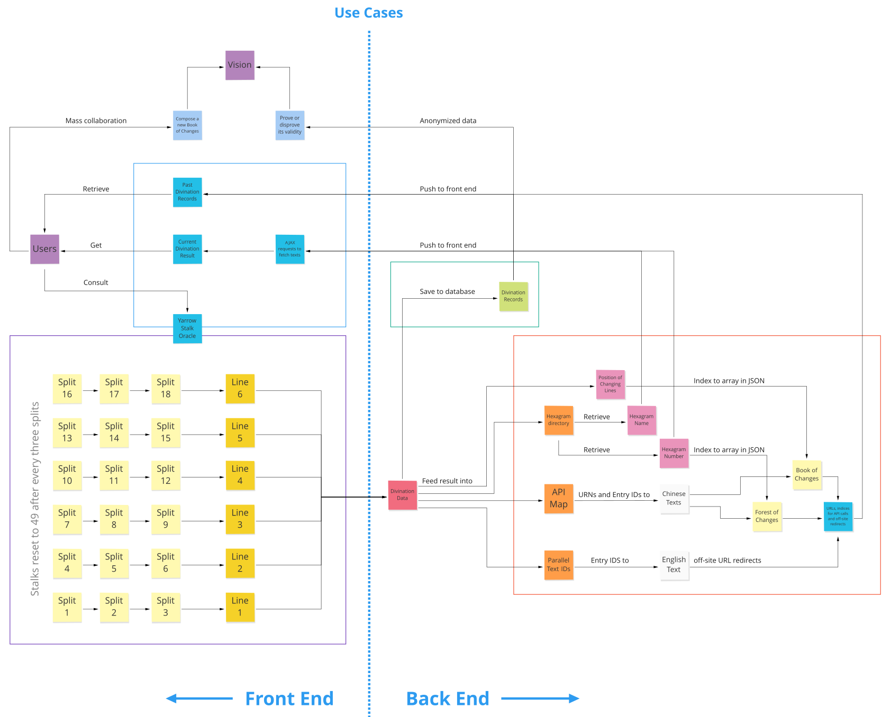
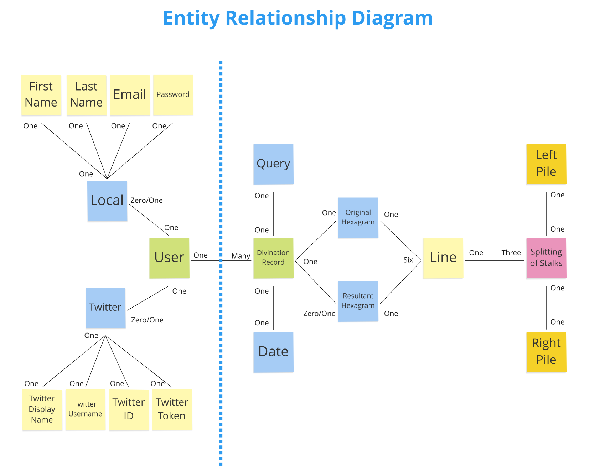
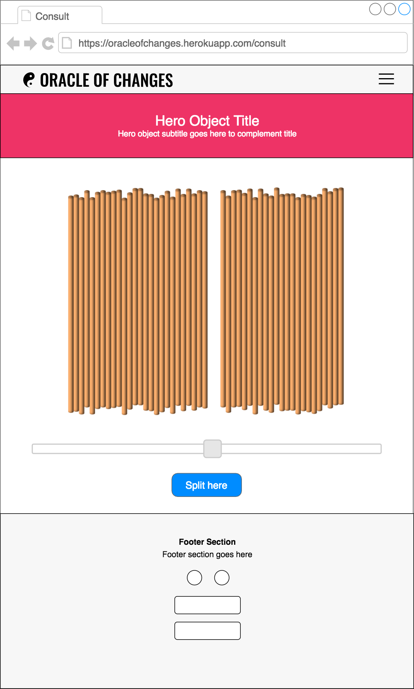
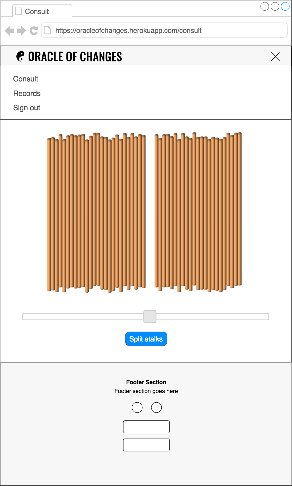
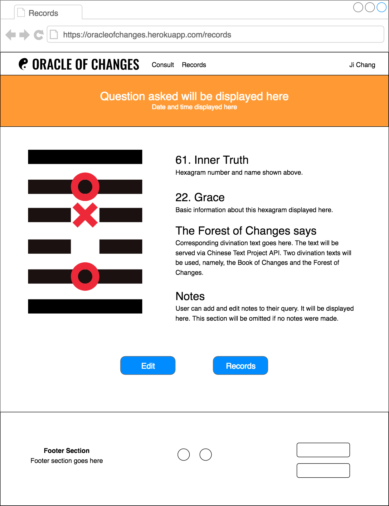

#  Project #2: Oracle of Changes

<p align="center"></p>

## Live Version

[Oracle of Changes](https://oracleofchanges.herokuapp.com) on Heroku
<!-- This is the starter code for WDI projects. Please update this README file with information specific to your project. Replace this paragraph for instance, with a short description of your project. Then update the sections below. Refer to your project specificaion for instructions on how to submit your projects. -->

## Getting Started
<!-- Provide instructions here about how to get your project running on our local machine. Do we just need to clone and open a certain file or do we need to install anything first. -->

### Prerequisites
<!-- What is needed to install and run the project, how do we install them -->
It is assumed you have Node.js and Yarn installed.

Clone this project to a local machine or server. Then install the node modules:

```
yarn install
```

#### Sign in with Twitter

For sign in with Twitter to work via `passport-twitter` node package:
1. Register an application with Twitter at [Twitter Application Management](https://apps.twitter.com) to receive a consumer key (API Key) and a consumer secret (API Secret).
2. Provide the actual callback URL to Twitter.
3. Lastly, add these to `config/config.js`.

#### MongoDB

Add the URL of your database to `config/config.js`.

### How to Use the Oracle of Changes

1. Sign up for a local account, or sign up with Twitter. You will be signed in after successfully creating an account or authentication with Twitter.
2. Press Consult on the navigation bar to head to the Yarrow Stalk Oracle.

<p align="center"></p>

3. Type in your query, then press Start.
4. Follow your instinct and click on the gap between the stalks to split it.

<p align="center"></p>

5. Three splits are needed to obtain a line, and six lines are needed to form a hexagram.

<p align="center"></p>

6. Once completed, press Submit to receive full divination result, complete with the relevant text from the Book of Changes and the Forest of Changes, supplemented with English translation whenever available.

The sorting into fours and taking out of remainders after each split is automatically taken care of. The raw divination data is captured in the table, with every line obtained shown in the last column.

## Built With

<!-- What did you use to build it, list the technologies, plugins, gems, packages etc. -->

### Technologies
- [Node.js](https://nodejs.org/)
- [MongoDB](https://www.mongodb.com)
- [Mongoose](http://mongoosejs.com/index.html)
- [Heroku](https://www.heroku.com)
- [mLabs](https://mlab.com)
- [jQuery](http://jquery.com/)
- JavaScript
- CSS
- HTML

### Node Packages
- `bcrypt`
- `body-parser`
- `connect-flash`
- `cookie-parser`
- `express`
- `express-handlebars`
- `express-session`
- `express-validator`
- `mongoose`
- `passport`
- `passport-local`
- `passport-twitter`
- `connect-mongo`
<!-- - `async` -->

### CSS Framework
- [Bulma v0.6.2](https://bulma.io)

### CSS/JS plugin
- [noUiSlider 11.0.3](https://refreshless.com/nouislider/)

## Workflow
<!-- Did you write user stories, draw wireframes, use task tracking, produce ERDs? Did you use source control, with regular commits? Include links to them here. -->

### Use Cases

<p align="center"></p>

### Entity Relationship Diagram

<p align="center"></p>

### Wireframes

#### Landing page

The navigation bar slides up and hides itself when the page is scrolled up. It will slide down to reveal itself again when the page is scrolled down.

<!--  -->
<p align="center"></p>

#### Sign in modal

<!--  -->
<p align="center"></p>

#### Sign up modal

<!--  -->
<p align="center"></p>

#### Consult Oracle page

Desktop and laptop users can hover their mouse cursors over the yarrow stalks and the gap will follow the cursor. The mouse cursor will change from the default arrow to a gloved hand pointer when it is over a gap. Upon reaching the desired spot, simply click on the gap to split the yarrow stalks. Clicking on the stalks will not trigger any split.

<!--  -->
<p align="center"></p>

The slider bar below the yarrow stalks is primarily intended for smartphone and tablet users as they will not be able to hover over the stalk and precisely choose where the spilt the stalks. With the slider bar, smartphone and tablet users will be able to split the stalk with the same precision as desktop and laptop users.

The yarrow stalks will resize to fit the width on smaller screens.

<!--  -->
<p align="center"></p>

#### Navigation Bar Burger and Menu for Smaller Viewports

<!--  -->
<p align="center"></p>

#### Display of divination result and individual past record

<!--  -->
<p align="center"></p>


### User Stories

As a casual user of the Oracle of Changes, I
- want to try the traditional yarrow stalk oracle without having to follow complicated instructions and physical equipment.
- want to try the yarrow stalk oracle without having to create an account
- do not want to be bogged down by the repetitive, lengthly, and mistakes prone procedure of the yarrow stalk oracle.

As a serious/committed user of the Oracle of Changes, I
- want to regularly consult the traditional yarrow stalk oracle without the hefty time commitment (typically 20 to 30 minutes to obtain a hexagram).
- want the divination result to be automatically generated from the hexagram obtained from the oracle
- want to conveniently refer to reliable sources for divination texts.
- want reliable Chinese-English correspondence of divination texts at my fingertips.
- want a clean, streamlined experience stripped of all the kitsch and clichéd design commonly associated with all things fortune-telling and Chinese.

## Acknowledgments

- [Chinese Text Project](http://ctext.org/) API for providing the texts of the Book of Changes and Forest of Changes
- [Bulma.io](https://bulma.io), apart from providing the CSS framework, for making possible the following JavaScript interactivity:
	- Navigation burger button toggle and animation effect:
		- Burger button toggles to close `✕` button and vice versa.
	- Navigation burger menu dropdown effect,
	- Navigation bar scrolling effects, including:
		- Slide up to conceal while scrolling down the page,
		- Slide down to reveal while scrolling up the page, and
		- Cast shadow when it is visible and fade out when top is reached
	- Modal toggle
- [Russell W. Cottrell, M.D.](http://www.russellcottrell.com/md/me.shtm) for his innovative [Virtual Yarrow Stalks](http://www.russellcottrell.com/VirtualYarrowStalks/).
	- Instead of the coin toss method or relying on a random number generator, Dr. Cottrell's Virtual Yarrow Stalks features a brilliant workaround by simply laying the yarrow stalks in a neat row across the screen with an inserted gap to simulate the split.
	- I believe this is the best possible virtual counterpart to the physical spliting of yarrow stalks by hand. Dr. Cottrell's Virtual Yarrow Stalks substantially replicates the traditional yarrow stalk method by intelligently adapting to the constraints of the new medium.
	- Additionally, unlike the coin toss method, this allows the uneven probabilities (6.25%, 31.25%, 43.75%, 18.75% respectively) of obtaining lines 6, 7, 8, and 9 to be retained.
