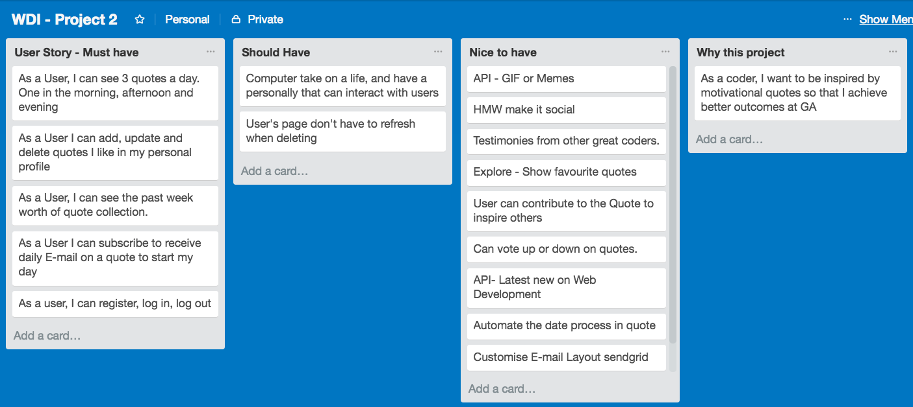
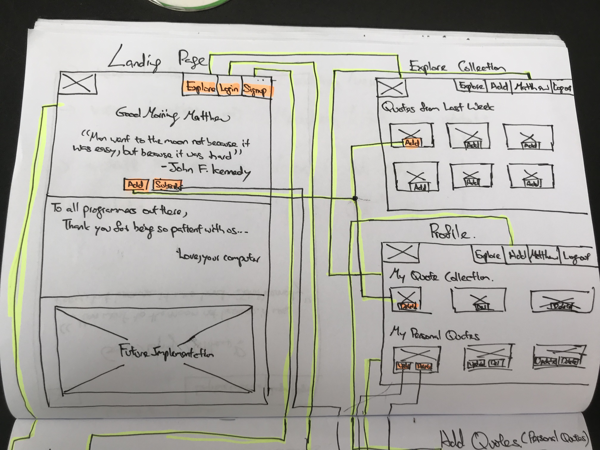
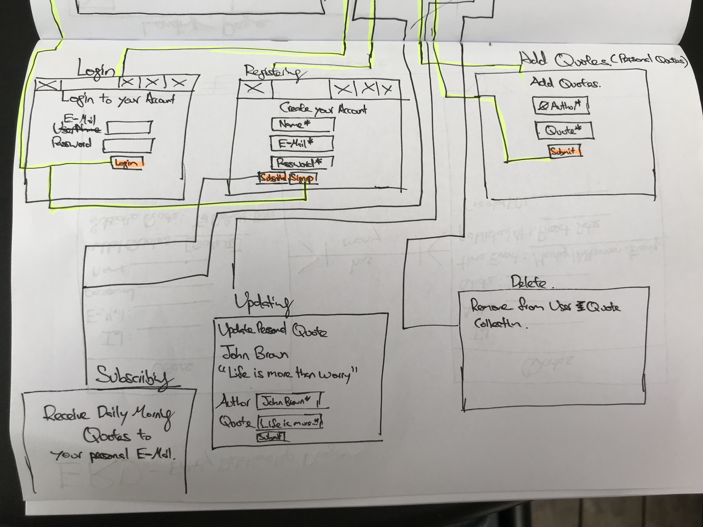
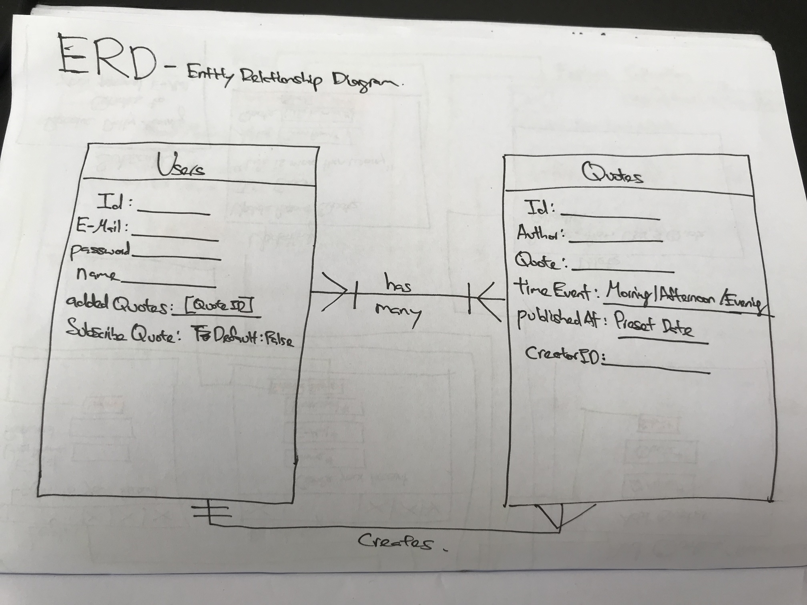

# Salty Lemon
Salty Lemon is an app for programmers who feel like when the going gets tough, and you feel like giving up, and you feel like you are not good enough that in moment of despair, you may find comfort and hope.

This app shows you three quotes at the homepage at specific time-interval that is tailored to speak to you at that time of the day.

## Live Version
• https://saltylemon.herokuapp.com/

Problem I'm trying to solve it for.

## Feature Prioritisation

## WireFrames

## Entity Relationship Diagram

## User Story Specific

## Built With

## Acknowledgements

This is the starter code for WDI projects. Please update this README file with information specific to your project. Replace this paragraph for instance, with a short description of your project. Then update the sections below. Refer to your project specificaion for instructions on how to submit your projects.

## Getting Started

Provide instructions here about how to get your project running on our local machine. Do we just need to clone and open a certain file or do we need to install anything first.

### Prerequisites

What is needed to install and run the project, how do we install them
