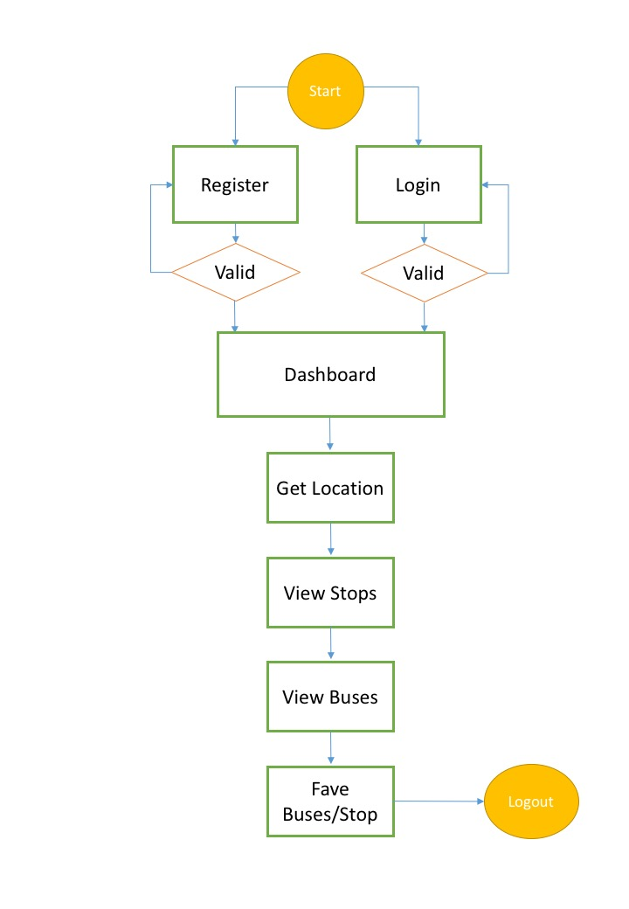
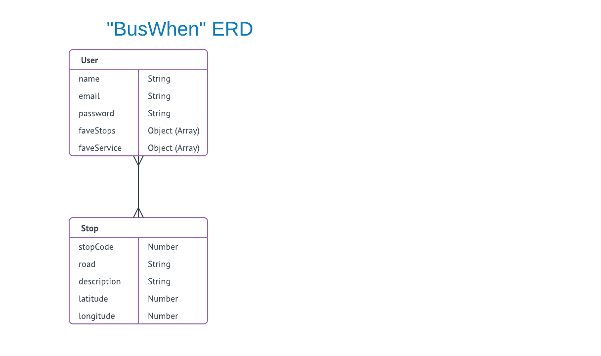
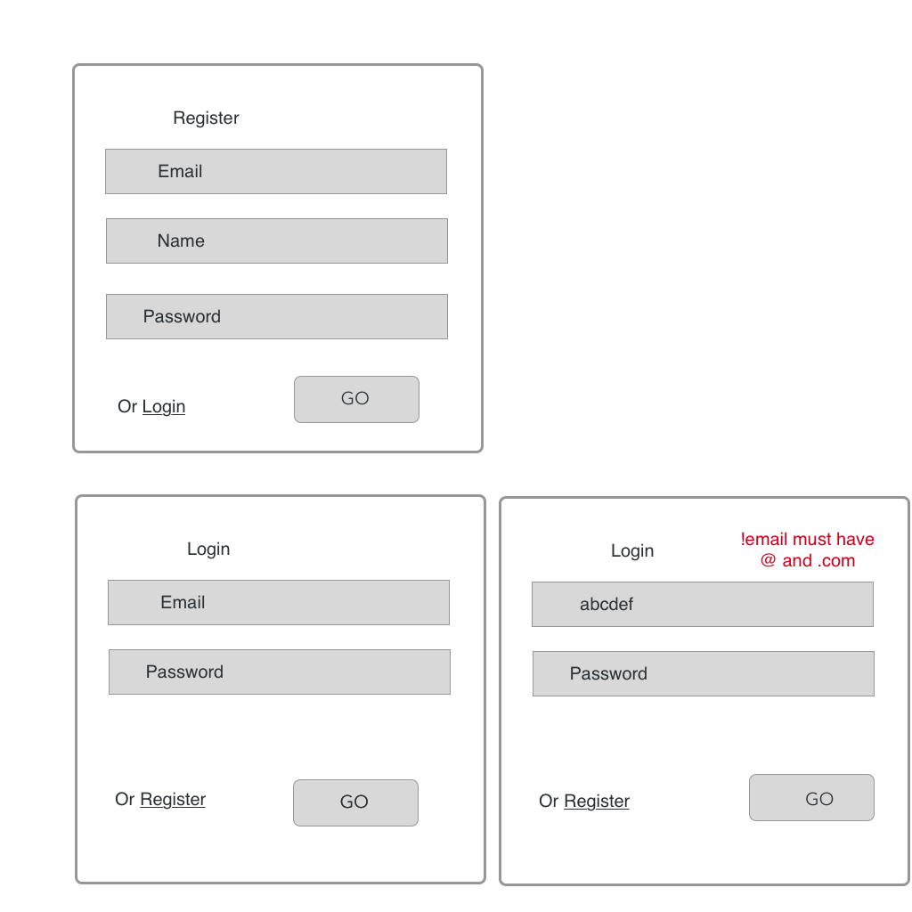
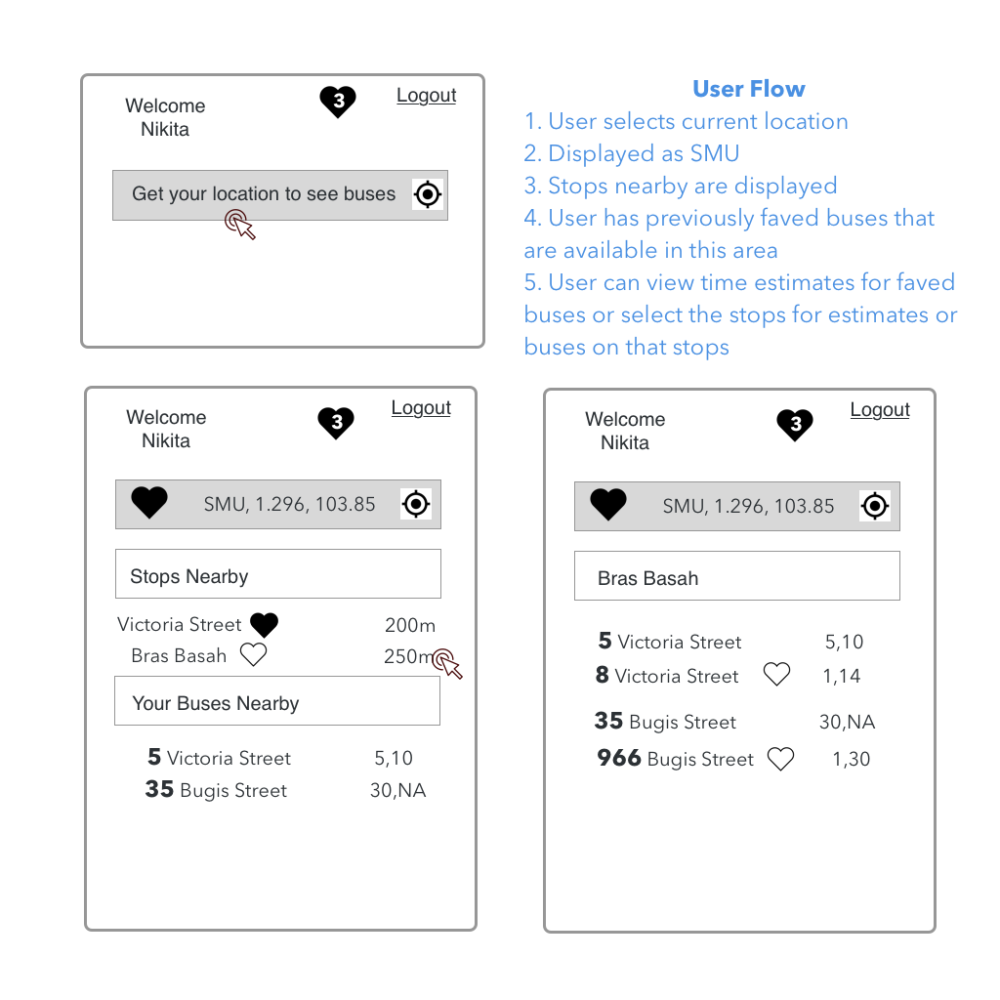

# Bus When
### [Bus When - Web App Link](https://nikitas-project2.herokuapp.com/)

Link: nikitas-project2.herokuapp.com
Get bus stops nearby along with real time bus arrival data, on your phone on desktop.

## Flowchart
<!--  -->




## Tech Stack:
Express on Node
Mongoose on MongoDB
Javascript and Jquery
Bootstrap

APIs
- LTA Transport Data
- Google Maps
- [Navigator.geolocation webapi](https://developer.mozilla.org/en-US/docs/Web/API/Navigator/geolocation)
- [Web Speech webapi](https://developer.mozilla.org/en-US/docs/Web/API/Web_Speech_API)

Packages: Handlebars, Moment, bcrypt, request-promise-native etc

## Getting Started
To run locally, get API keys and add to env
1.	[Transport API](https://www.mytransport.sg/content/mytransport/home/dataMall.html)
2. [Google Maps API (optional)](https://developers.google.com/maps/documentation/static-maps/intro)

Installation
1.	Install yarn/npm
2.	Run yarn init
3.	Yarn add all – to install all dependencies found in package.json file
4.	Restore from collection hosted here: [stops.bson](http://s000.tinyupload.com/?file_id=72779861239136983602)
OR run ‘<host>/load/stops’ which will load bus stops from API


### User Stories
User stories
1. As a busy student, I want to check bus timings on stop near my place so I can plan my route on the go.
E.g. Do I take bus 5 to GA from Eunos Link or 8/22 to MRT from bedok Reservoir Road.

2. As a busy commuter, I want to use my voice to check bus timings instead of tapping commands on the phone as I’m gathering my things to save time and leave quickly.


## Workflow

### ERD


### Wireframes



### Routes
```
(‘/home’)
GET /
POST /

('/login')
Get /
Post /

('/register')
Get /
Post /

('stop/:code')
GET /

('/load/stops')
GET /
('/load/serviceFromRoutes')
GET / (Phase 2)

('/save/stops/:code')
GET /
('/save/bus/:code’)
GET / (Phase 2)
```

## Acknowledgments
Many thanks to Alex and Prima for tireless help in the project.

## Phase 2
1. Store location in session, and clear with set my location button. So between toggling pages, the data persists in a session
2. Saved bus stops - show on dashboard(home) even if not nearby (reference for route planning)
3. Saved buses - show on dashboard(home) if its stop is available nearby
4. Show all saved stops and buses, with ability to remove
5. Add search for bus or stop with voice support
6. More voice commands supported
